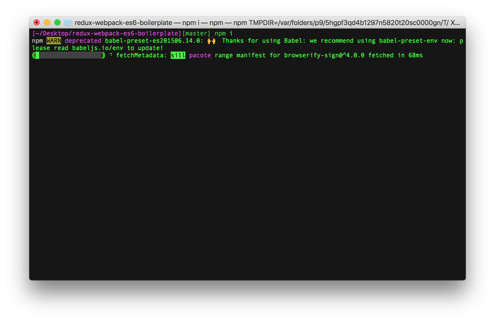
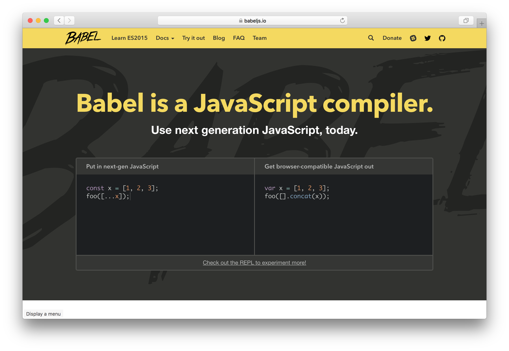

# Writing Your First Babel Plugin 🛠
## Josh Parnham

---

What is Babel?



---



---

# How it's used

- Build tools, such as `webpack`
- Via the CLI, `babel-cli`
- Directly through `babel-node`

---

<!--
If you've ever used these Facebook technologies, like React, React Native, Jest (the JavaScript testing framework) or Flow (the genesis of the Redux statement management pattern), you will have used Babel under the covers.

So whilst you probably will never need to write a Babel plugin, hopefully this talk can give you a better understanding of this ecosystem and how it can be used in your own projects.
-->


---

# Configuration

`.babelrc` from `create-react-native-app`:

    {
      "presets": [
        "babel-preset-react-native-stage-0/decorator-support"
      ],
      "env": {
        "development": {
          "plugins": [
            "transform-react-jsx-source"
          ]
        }
      }
    }

<!--
The babel-preset-react-native-stage-0 is a collection of plugins (and also the `babel-preset-react-native` preset).

`decorator-support` is a file in the package that just exports the required preset and extra plugins.

The `transform-react-jsx-source` is described as "Adds source file and line number to JSX elements".
-->

---

# Configuration

- Preset
    - Set of plugins
- Plugin
    - *Transform* & *Syntax*

<!--
Transform plugins can enable the required syntax plugins with the `inherits` in their definition.

https://github.com/jamiebuilds/babel-handbook/blob/master/translations/en/plugin-handbook.md#-enabling-syntax-in-plugins
-->

---

# Order of Operation

--

## Parse ➡️ Transform ➡️ Generate

---

# Abstract Syntax Trees (ASTs)

---

`5 + 2`


---

# 🔗 astexplorer.net

---

`5 + 2`

```json
"expression": {
    "type": "BinaryExpression",
    ...
    },
    "left": {
        "type": "Literal",
        "value": 5,
        ...
    },
    "operator": "+",
    "right": {
        "type": "Literal",
        "value": 2,
        ...
    }
}
```
---

# Transformation

<!--
A Babel transformer will the traverse the AST, calling each method in the `visitor` object that is of a corresponding type.
-->

- Input & output should be valid (Babylon-supported) JS ✅
    - tc39 stage features
    - Flow, JSX, etc
- Doesn't support third-party syntax plugins ❌

---

# Example

---

### babel-plugin-transform-fun-chaos

<!--
If you're just about to quit your job, you should sneak this in.

Simply changes all of the pluses to minuses.
-->


```js
module.exports = function({ types: t }) {
  return {
    name: 'transform-fun-chaos',
    visitor: {
      BinaryExpression(path) {
        if (path.node.operator !== '+') return

        path.replaceWith(
            t.binaryExpression('-', path.node.left, path.node.right)
        );
      }
    }
  };
};
```

---

### babel-plugin-transform-fun-chaos

<!--
And because these plugins are themselves JavaScript, we can execute code, such as randomly changing plusses to minuses.
-->

```js
module.exports = function({ types: t }) {
  return {
    name: 'transform-fun-chaos',
    visitor: {
      BinaryExpression(path) {
        if (path.node.operator !== '+') return

        if (Math.random() > 0.5) {
          path.replaceWith(
            t.binaryExpression('-', path.node.left, path.node.right)
          );
        }
      }
    }
  };
};
```
---

### babel-plugin-transform-fun-chaos

<!--
Or changing them after 5 PM.
-->

```js
module.exports = function({ types: t }) {
  return {
    name: 'transform-fun-chaos',
    visitor: {
      BinaryExpression(path) {
        if (path.node.operator !=='+') return

        const afterFivePM = (new Date()).getHours() >= 17
        if (afterFivePM) {
          path.replaceWith(
            t.binaryExpression('-', path.node.left, path.node.right)
          );
        }
      }
    }
  };
};
```

---

# Actual Example

<!--
NaN has some interesting properties, such as:

NaN == NaN
// false

NaN === NaN
// false

Number.isNan(NaN)
// true

We can utilise this to create a Babel plugin which will automatically convert NaN equality checks to use the correct function.
-->

### `NaN`

---

### babel-plugin-transform-nan-equality

```js
module.exports = function({ types: t }) {
  return {
    name: 'transform-nan-equality',
    visitor: {
      BinaryExpression(path) {
        if (
          (path.node.operator !== '==' && path.node.operator !== '===') &&
          (path.node.left.name !== t.identifier('NaN').name) &&
          (path.node.right.name !== t.identifier('NaN').name)) {
          return
        }

        if (path.node.left.name === t.identifier('NaN').name) {
            path.replaceWithSourceString(`isNan(${path.node.right.name})`)
        } else if (path.node.right.name === t.identifier('NaN').name) {
            path.replaceWithSourceString(`isNan(${path.node.left.name})`)
        }
      }
    }
  };
};
```

---

# Should anyone ever actually do this?

<!--
Whilst this was an interesting exercise, the real value of these plugins is that the Babel ecosystem can be extended as language features are added and evolve. Performing source code modifications such as above would be better handled by a linter.
-->

# 🙈

---

# Should anyone ever actually do this?

## Nah.

---

# Thanks ✌️
## @joshparnham
